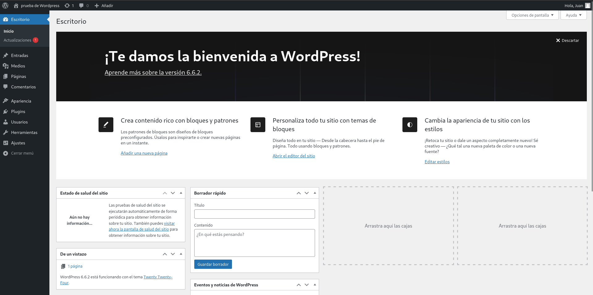

# Tarea 4. SXE.

## 1. Utiliza la imagen de Ubuntu , tag 22 y instalar LAMP dentro del contenedor creado:

1.1 Creamos el contenedor con nombre **contenedorLamp**:

```bash
 docker run -d --name contenedorLamp -p 8080:80 ubuntu:22.04 tail -f /dev/null
```
* el comando **tail -f /dev/null**, para que el contenedor este siempre en ejecución.

**Dentro del contendor ya creado:**

1.1 Actualizamos los paquetes:

```bash
apt update
```

1.2 Instalamos Apache:

```bash
apt install -y apache2 apache2-utils
```
1.3 Instalamos MariaDB:

```bash
apt install -y mariadb-server mariadb-client
```

1.4 Configuración de MariaDB:
```bash
mysql_secure_installation
```

1.5 Instalamos PHP:

```bash
apt install -y php php-mysql libapache2-mod-php
```
-Puedes comprobar si cada configuración funciona correctamente con:

```bash
service "nombre_del_servicio" status
```

## 2.Instalación WordPress

**2.1.Instalar WorldPress:**

```bash
mkdir -p /srv/www #Crea el directorio

chown www-data: /srv/www # se cambia el propietario del directorio /srv/www al usuario www-data y su grupo correspondiente

curl https://wordpress.org/latest.tar.gz | tar zx -C /srv/www  #Descarga el archivo comprimido WordPress más reciente y se asegura que sea el usuario "www-data", sea el que extraiga los archivos
```

**2.2 Configurar Apache para WordPress:**

* Corremos Apache, si aún no lo estemos haciendo:

```bash
    service apache start
```

* Creamos el archivo de configuracion para el sitio de WorldPress:

```bash
nano /etc/apache2/sites-available/wordpress.conf
```

* Pegamos esto en el archivo:

```bash
<VirtualHost *:80>
    DocumentRoot /srv/www/wordpress
    <Directory /srv/www/wordpress>
        Options FollowSymLinks
        AllowOverride Limit Options FileInfo
        DirectoryIndex index.php
        Require all granted
    </Directory>
    <Directory /srv/www/wordpress/wp-content>
        Options FollowSymLinks
        Require all granted
    </Directory>
</VirtualHost>
```

* Después de crear el archivo de configuración, debes habilitar el sitio en Apache:

```bash
a2ensite wordpress.conf
```

* WordPress necesita el módulo mod_rewrite de Apache para gestionar las URL amigables. Habilítalo con este comando:

```bash
a2enmod rewrite
```

* Desactivar el sitio predeterminado de "Funcionar con:

```bash
a2dissite 000-default
```

* Recargamos Apache:

```bash
service apache2 reload
```

**2.3 Configurar la base de datos:**

-Para configurar WordPress, necesitamos crear la base de datos MySQL. Vamos a hacerlo.

* Accedemos a MariaDB:

```bash
mysql -u root -p
```

* Creamos la BBDD:

```bash
CREATE DATABASE wordpress;
```

* Creamos el usuario de base de datos para WordPress:

```bash
CREATE USER 'wordpress'@'localhost' IDENTIFIED BY '<contrasena_a_eleccion>';
```

* Asignar permisos al usuario wordpress:

```bash
GRANT SELECT,INSERT,UPDATE,DELETE,CREATE,DROP,ALTER
ON wordpress.*
TO 'wordpress'@'localhost';
```

* Actualizamos los privilegios:

```bash
FLUSH PRIVILEGES;
```

* Salimos de MariaDB:

```bash
quit;
```

**2.4 Configurar WordPres para conectarse a la base de datos:**

* Copia el archivo de configuración: 

```bash
cp /srv/www/wordpress/wp-config-sample.php /srv/www/wordpress/wp-config.php;
```

* Actualizar las credenciales de la base de datos:

```bash
sed -i 's/database_name_here/wordpress/' /srv/www/wordpress/wp-config.php;
sed -i 's/username_here/wordpress/' /srv/www/wordpress/wp-config.php;
sed -i 's/password_here/<tu_constrasena_wordpress>/' /srv/www/wordpress/wp-config.php;
```

* Abrir el archivo wp-config.php para editar las claves de autenticación:

```bash
nano /srv/www/wordpress/wp-config.php
```
* Modificar las claves de autenticación:

```bash
define( 'AUTH_KEY',         'put your unique phrase here' );
define( 'SECURE_AUTH_KEY',  'put your unique phrase here' );
define( 'LOGGED_IN_KEY',    'put your unique phrase here' );
define( 'NONCE_KEY',        'put your unique phrase here' );
define( 'AUTH_SALT',        'put your unique phrase here' );
define( 'SECURE_AUTH_SALT', 'put your unique phrase here' );
define( 'LOGGED_IN_SALT',   'put your unique phrase here' );
define( 'NONCE_SALT',       'put your unique phrase here' );
###### ESTO LO BORRAREMOS Y LO SUSTITUIREMOS POR OTRAS CLAVES GENERADAS POR LA SIGUIENTE URL 
```

```bash
https://api.wordpress.org/secret-key/1.1/salt/
```

## 3. Visualización de WordPress

-En el navegador ya con los pasos anteriores finalizados, acceso a WordPress con la url: http://localhost:8080, y si todo funcionó correctamente ya podemos usar WordPress a nuestro antojo.

*Captura ya dentro de WordPress:




